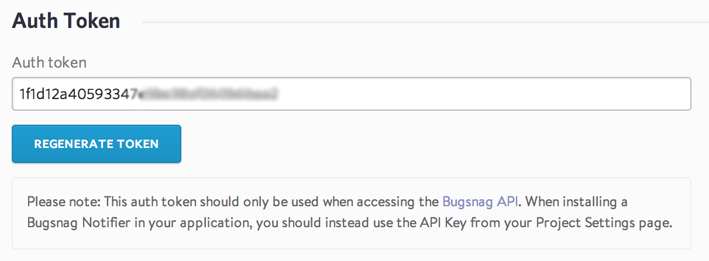
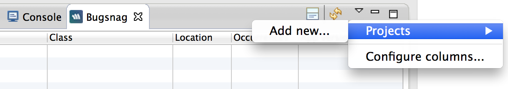
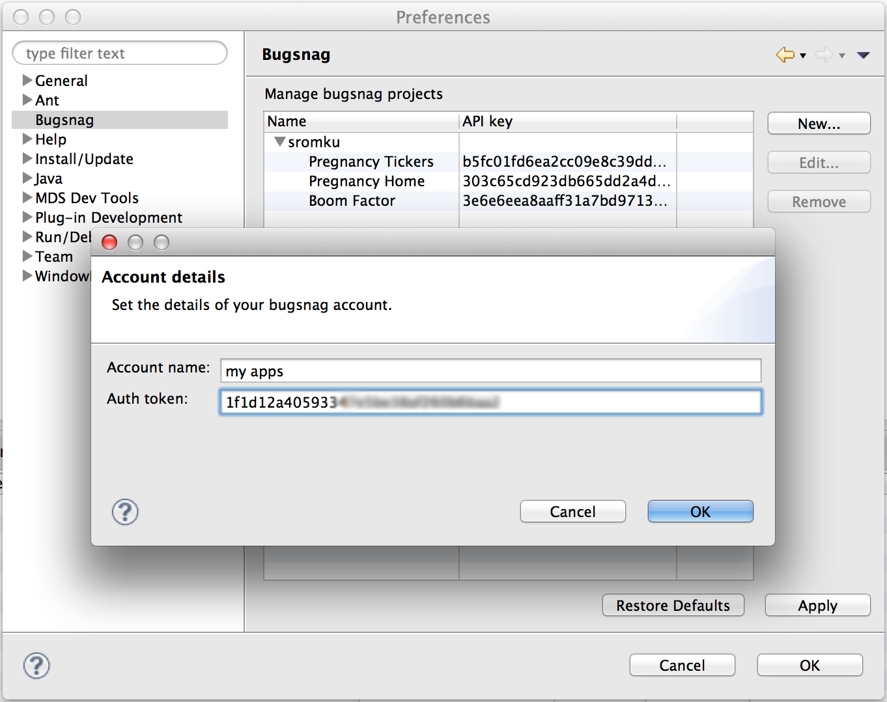
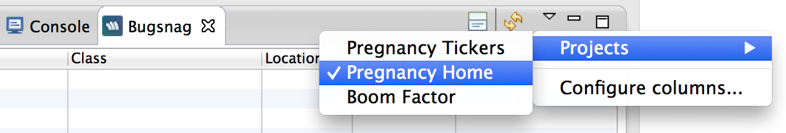
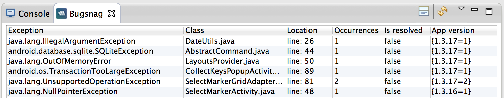
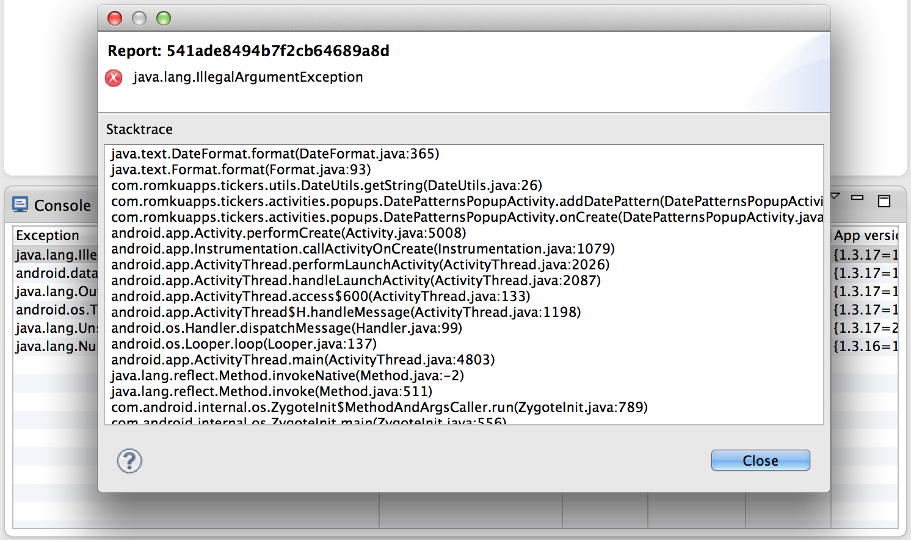
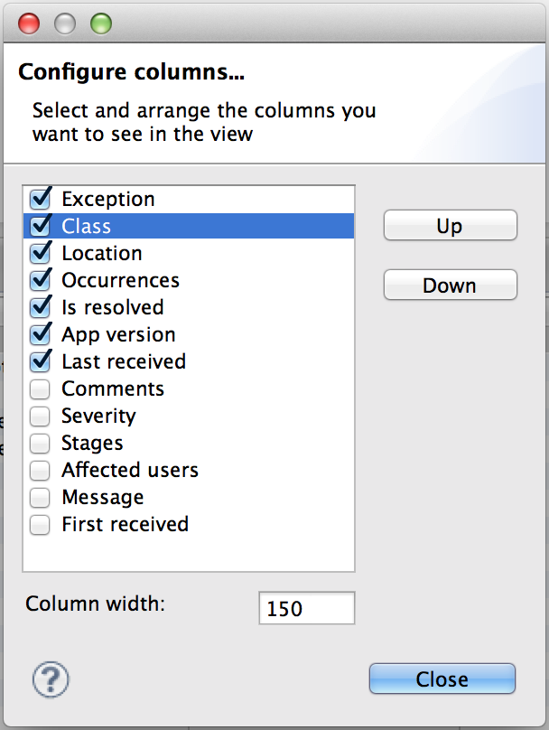

 bugsnag-eclipse-plugin
======================
Plugin which shows you the bugs from your Bugsnag projects + few useful features

### Update site 
http://code.sromku.com/plugins/

> When setting update site -> uncheck: 'Group items by category'

### Options
1. Add,edit bugsnag accounts
2. Show all projects from all accounts
3. Fetch errors of selected project
4. See full stacktrace of the error
5. **Double click** on the error and go the java class to the right line in the editor
6. Customize view columns

### Story
When developing android apps, I found out that fixing bugs isn't the fun part of development time, I only wanted to create more new features instead. But, leaving the bugs on the user side wasn't a good move. Then, I though that seeing the bugs in my IDE and easy accessing the line in code, will help me to resolve them faster and will not free my conscience if I choose to develop new features instead. So, this what pushed me to develop such plugin.

### How to use it
#### Connect accounts
* Go to your Bugsnag account and copy `Auth token`. It looks like this:
	
	
	
* Open the Bugsnag view in eclipse (Window->Show View->Other...)

	

* From drop down menu -> Projects -> Add new...

	

#### Manage accounts & projects
* Preferences -> Bugsnag -> Press `New...` to add new account with all projects.

	

#### View project errors
* Go to view -> drop down menu -> Projects -> select the project you want.

	

* Press `refresh` button and view errors.

	

	

#### Double click will take you to the java class! :)

#### View error stacktrace
* Select error row and press on `details` button.

	

	

#### Customize columns
* Go to view -> drop down menu -> `Configure columns...`
	
	

### Bugsnag API:
https://bugsnag.com/docs/api

### Contribute
Feel free to pull request and suggest new features.
Opening bugs is also ok :)

### License
Apache License Version 2.0